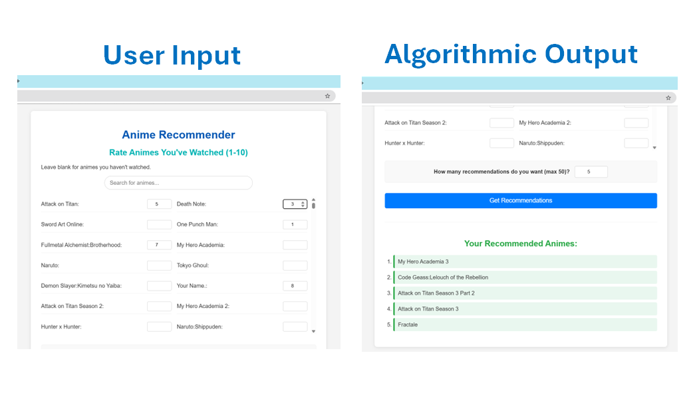

# Anime Discovery & Recommendation Engine

## 🚀 Overview
[cite_start]This project is a full-stack data science application that provides personalized anime recommendations by processing a sparse **15GB user-interaction dataset**[cite: 34]. [cite_start]Transitioning from high-level research in Jupyter Notebooks to a functional web dashboard, the system identifies deep latent relationships between 13,000+ titles [cite: 35] that traditional genre-tagging often misses.

---

## 🕹️ One-Click Local Demo
To explore the recommendation dashboard on your own machine:
1. **Prerequisites:** Ensure you have **Python 3.10+** installed on your system.
2. **Clone** the repository.
3. Navigate to the `/app` folder.
4. Double-click **`run_website.bat`**.
   * *Note: The demo runs instantly using lightweight, pre-computed similarity matrices. It will not download the original 15GB dataset.*
   * *This script automatically handles virtual environment creation, dependency installation (`Flask`, `pandas`, `numpy`), and launches the web server.*
   * Once running, the dashboard will open in your browser at `http://127.0.0.1:5000`.

---

## 🛠️ Technical Implementation

### **1. Core Algorithmic Architecture**
* [cite_start]**Spectral Clustering:** Constructed similarity matrices using cosine similarity of user rating vectors, performing spectral embedding via normalized graph Laplacian eigen decomposition to discover 13 distinct thematic "communities"[cite: 148, 149].
* [cite_start]**Recommendation Logic:** Built a user-based collaborative filtering engine using per-item nearest neighbor matching[cite: 151], backed by a **custom Max-Heap (Priority Queue)** to efficiently rank top recommendations in $O(K \log N)$ time.
* **Big Data Optimization:** Managed a sparse 15GB user-rating dataset using **SciPy CSR matrices**, allowing for high-speed similarity calculations and eigendecompositions on consumer hardware[cite: 52].

### **2. Validation & Testing**
* [cite_start]**Mathematical Fidelity:** Developed a custom Fidelity Scoring metric to evaluate data purity, relation preservation, and size balance[cite: 136]. 
* [cite_start]**Human-in-the-Loop Validation:** Designed an automated "Odd One Out" quiz using k-medoids selection[cite: 202]. [cite_start]Distributed to anime communities, the algorithm's clusters aligned with human perception significantly above random chance (92.3% of questions beat the baseline)[cite: 230].

### **3. Advanced Research & Exploration (Multimodal)**
* [cite_start]**Computer Vision:** Engineered experimental pipelines using **ResNet50** and **VGG16** to extract visual embeddings from anime cover art to test aesthetic-based clustering[cite: 135]. 
* **Dimensionality Reduction:** Implemented **Singular Value Decomposition (SVD)** to condense image feature complexity while maintaining 90%+ variance during the exploratory phase. *(Note: User rating vectors ultimately proved mathematically superior to image-based clustering for this specific dataset [cite: 136]).*

### **4. Full-Stack Web Application**
* **Frontend/Backend:** Architected a **Flask** web dashboard from scratch, featuring real-time client-side search filtering and dynamic recommendation generation.
* **UX:** Designed for simplicity, allowing users to rate their favorite shows and receive instant, personalized suggestions based on nearest-neighbor behaviors[cite: 508].

---

## 📘 Detailed Methodology
For a deep dive into the mathematical foundations, data processing pipeline, and algorithmic validation, please refer to the **[Technical_Report_Anime_Recommendations.pdf](./Technical_Report_Anime_Recommendations.pdf)** located in the root directory.

---

## 👥 Collaboration & Credits
This system was built as a highly collaborative effort. While all three of us contributed to the overarching system design, data strategy, and algorithmic architecture, we each took primary ownership over specific technical domains:

* **Yitschak Kupinsky** ([yitschak.kupinsky@mail.huji.ac.il](mailto:yitschak.kupinsky@mail.huji.ac.il)): Lead Architect of the **Full-Stack Web Application**, independent developer of the exploratory **Multimodal Image Analysis (SVD/ResNet)** pipeline, and developer of the **Max-Heap ranking system**.
* **Osher Serero** ([osher.serero@mail.huji.ac.il](mailto:osher.serero@mail.huji.ac.il)): Primary focus on the **Core Clustering Logic**, similarity matrix optimizations, handling sparse data structures, and statistical data analysis.
* **Ehud Kotegaro** ([ehud.kotegaro@mail.huji.ac.il](mailto:ehud.kotegaro@mail.huji.ac.il)): Primary focus on **Model Validation**, designing the robust Fidelity Testing framework, and engineering the "Odd One Out" human-validation logic and cross-analysis.

---

## 👨‍💻 Primary Contact
**Yitschak Kupinsky**
* [LinkedIn](https://www.linkedin.com/in/yitzchak-kupinsky/)
* yitzchak.kupinsky@gmail.com